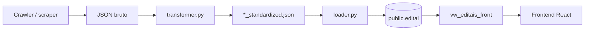

# Backend 2 — Mapa do pipeline de integração

**Objetivo:** localizar onde plugar `normalize_deadline` / `classify_record_full` sem quebrar crawlers nem o schema atual.

---

## Fluxo end-to-end



---

## 1. Entrada bruta do crawler

| Origem | Formato | Campos de prazo típicos |
|--------|---------|-------------------------|
| Crawlers por fonte (`scrapers/`, `CORE/crawlers/`) | dict/list JSON | `fim_inscricao`, `prazo_envio`, `deadline`, `close_date` |
| `scraper_genérico` / `transform_generic` | lista heterogênea | mistura PT/EN + texto livre |
| Asia / Grants.gov | extras + inglês | `closing_date`, `submission_deadline` em extras |

O crawler **não** passa pelo `opportunity_enricher` hoje; grava campos nativos da fonte.

---

## 2. Transformação atual (`CORE/transformer.py`)

| Etapa | Função / bloco | Saída |
|-------|----------------|-------|
| Entrada | `transform_generic(data, source_name)` | itens brutos por fonte |
| Item | `_transform_item_with_result` → bloco ~2767+ | `fim_inscricao` ISO via `normalize_date_str` + `extract_deadline_from_text` |
| Extras | `merge_item_extras`, `enrich_patch` | `fim_inscricao_original`, PDF, defesa, Asia |
| Taxonomia | `enrich_opportunity_classification` (`taxonomy_filtros`) | `tipo_oportunidade`, filtros — **distinto** do Backend 2 |
| Qualidade | `apply_quality_to_payload` | `qualidade_dado` em extras |
| Saída | `TransformResult.payload` | dict canônico → `CORE/transformer/*_standardized.json` |

**Campos canônicos do item transformado:** `titulo`, `descricao`, `link`, `fonte`, `data_publicacao`, `fim_inscricao`, `situacao`, `valor`, `programa`, `acao`, `tipo_recurso`, `extras`.

---

## 3. Carga no banco (`CORE/loader.py`)

| Etapa | Função | Observação |
|-------|--------|------------|
| Leitura | `load_standardized_json` | lista de itens |
| Normalização | `schema.normalizar(item)` | aliases e limpeza |
| Roteamento | `get_destination_table` / `content_routing` | edital vs noticia vs pesquisa |
| Map | `map_to_db_schema` | **`prazo_envio` ← `fim_inscricao`** |
| Upsert | `upsert_routed_item` → `inserir_ou_atualizar_edital` | `_strip_payload` só colunas permitidas |
| Extras | merge em coluna `extras` (extended schema) | sem colunas Backend 2 ainda |

`DB.py` / `db.py`: cliente Supabase; não transforma registros.

---

## 4. View frontend

- `public.vw_editais_front` — ver `migrations/20260505_recreate_edital_views_credito_staging.sql`
- Proposta de novos campos: `docs/sql/PROPOSAL_VW_EDITAIS_FRONT_BACKEND_1.sql` (não aplicada)

---

## 5. Pontos recomendados de integração (Backend 2)

### `normalize_deadline` / classificação completa

| Prioridade | Ponto | Modo |
|------------|-------|------|
| **1 (dry-run)** | `scripts/dry_run_backend_enrichment.py` | lê DB/JSON, chama `enrich_opportunity_record`, gera relatórios |
| **2 (opcional)** | Final de `_transform_item_with_result` | `apply_backend_enrichment_if_enabled(out)` — flag **off** por padrão |
| **3 (opcional)** | Início de `upsert_routed_item` | mesmo hook; grava só `extras.backend_enrichment` |
| **4 (futuro)** | Job de backfill + migration | colunas dedicadas + view |

### Por que após o transform e antes do loader?

- O classificador usa `titulo`, `descricao`, `extras`, `fonte_recurso` já enriquecidos (PDF, Asia, defesa).
- Não altera `fim_inscricao` legado — evita regressão em crawlers que já parseiam data.
- Loader continua com `_strip_payload`; preview fica em `extras.backend_enrichment`.

---

## 6. Feature flag

```bash
EDITALFINDER_ENABLE_BACKEND_ENRICHMENT=false   # padrão
EDITALFINDER_ENABLE_BACKEND_ENRICHMENT=true    # só após dry-run aprovado
```

Implementação: `CORE/opportunity_enricher.py` → `apply_backend_enrichment_if_enabled`.

---

## 7. Arquivos relacionados

| Arquivo | Papel |
|---------|--------|
| `CORE/deadline_normalizer.py` | prazo estruturado + status |
| `CORE/opportunity_classifier.py` | kind, modalidade, geo, fonte |
| `CORE/opportunity_enricher.py` | orquestração Backend 2 |
| `scripts/dry_run_backend_enrichment.py` | métricas sem DB write |
| `docs/backend/BACKEND_2_ENRICHMENT_DRY_RUN.md` | guia operacional |
