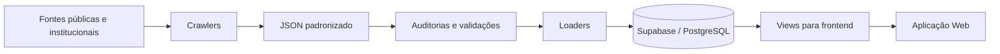

# 🔎 EditalFinder

**EditalFinder** é uma plataforma de inteligência de oportunidades voltada à coleta, organização, auditoria e apresentação de editais, chamadas públicas, linhas de fomento, crédito, pesquisa, inovação, fornecedores e portais estratégicos.

O projeto nasceu para resolver um problema recorrente: informações de fomento, crédito, inovação, pesquisa e contratação estão espalhadas em dezenas de portais públicos, institucionais e internacionais, frequentemente em formatos inconsistentes, com dados incompletos e pouca padronização.

O EditalFinder automatiza parte desse processo: coleta dados, transforma informações em registros estruturados, valida a qualidade dos dados e disponibiliza tudo em uma aplicação web com foco em busca, compatibilidade e tomada de decisão.

> Status: projeto em desenvolvimento, com ambiente de staging, pipelines de validação e módulos em evolução.

---

## 🚀 Visão do Projeto

Encontrar oportunidades relevantes costuma ser um processo manual, fragmentado e sujeito a erros. O EditalFinder busca centralizar e qualificar esse fluxo, permitindo que empresas, pesquisadores, instituições e equipes de inovação acompanhem oportunidades com mais precisão.

A plataforma foi pensada para responder perguntas como:

- Quais editais estão abertos agora?
- Quais oportunidades combinam com o perfil de uma empresa ou projeto?
- Quais chamadas são de crédito, subvenção, pesquisa ou inovação?
- Quais fontes são confiáveis?
- Quais oportunidades estão incompletas, vencidas ou precisam de revisão?
- Quais portais estratégicos existem para fornecedores, procurement e investimentos?

---

## ✨ Principais Módulos

### 📄 Editais e Chamadas

Coleta e estrutura editais, chamadas públicas, linhas de crédito, programas de fomento, oportunidades de pesquisa, inovação, defesa, energia, indústria, ciência e tecnologia.

Os dados são normalizados em uma tabela principal de editais, com campos como:

- título;
- link oficial;
- fonte;
- tipo de oportunidade;
- tipo de recurso;
- prazo;
- valor;
- área;
- setor estratégico;
- perfil ideal;
- status de validação;
- qualidade do dado.

---

### 🎯 Radar de Fomento

O Radar de Fomento cruza oportunidades disponíveis com o perfil de um cliente/projeto.

A ideia é apoiar uma decisão mais rápida sobre quais editais fazem sentido para uma organização, considerando critérios como:

- afinidade temática;
- localização;
- porte e elegibilidade;
- maturidade do projeto;
- faixa de valor;
- regularidade;
- prazo e situação.

---

### 🧾 Cadastro de Clientes e Pré-cadastro de Projetos

O sistema possui um módulo de cadastro de clientes e projetos, permitindo organizar informações que podem ser usadas para:

- análise de compatibilidade;
- geração de relatórios;
- apoio à submissão de propostas;
- criação de documentos PDF personalizados.

---

### 📰 Notícias Científicas

Além de editais, o EditalFinder também organiza notícias relevantes de ciência, tecnologia, inovação, energia, defesa, espaço e temas estratégicos.

Essas notícias ficam separadas dos editais para evitar ruído no fluxo principal de oportunidades.

---

### 🔬 Pesquisas e Publicações

O projeto também possui uma camada para pesquisas, publicações, relatórios técnicos e documentos científicos relevantes.

Esse módulo permite acompanhar tendências de pesquisa e desenvolvimento sem misturar publicações com editais tradicionais.

---

### 🌐 Portais Estratégicos: Fornecedores & Investimentos

Nem toda oportunidade estratégica é um edital.

Por isso, o EditalFinder possui uma estrutura separada para **Portais Estratégicos**, incluindo:

- portais de fornecedores;
- supplier registration;
- hubs corporativos;
- procurement;
- documentação para fornecedores;
- portais de investimento;
- internacionalização;
- corporate venture;
- programas de inovação aberta.

Esses dados são armazenados em `public.portal_estrategico`, separados de `public.edital`, evitando que hubs, cadastros e páginas de documentação poluam o Radar de Fomento.

Exemplos de uso:

- cadastro de fornecedor em grandes empresas;
- portais HICX, iSupplier e Oracle;
- hubs de procurement;
- documentação de compliance;
- programas internacionais de investimento e inovação.

---

## 🧠 Arquitetura Geral



O fluxo principal segue a lógica:

1. **Coleta**  
   Crawlers acessam fontes oficiais, feeds, páginas públicas e documentos.

2. **Transformação**  
   Os dados brutos são convertidos em JSONs padronizados.

3. **Auditoria**  
   O sistema verifica ruídos, campos ausentes, taxonomias amplas, status suspeitos e problemas de qualidade.

4. **Dry-run**  
   Antes de qualquer escrita no banco, os loaders simulam a carga.

5. **Apply em staging**  
   Quando aprovado, o lote é aplicado em ambiente de staging.

6. **Validação pós-carga**  
   Scripts verificam se tabelas, views, campos críticos e regras de negócio continuam corretos.

7. **Frontend**  
   A aplicação consome views específicas para editais, notícias, pesquisas e portais estratégicos.

---

## 🗄️ Modelo de Dados

O backend usa PostgreSQL/Supabase com tabelas e views organizadas por tipo de informação.

### Tabelas principais

| Tabela | Função |
|---|---|
| `public.edital` | Editais, chamadas, crédito, fomento e oportunidades tradicionais |
| `public.noticia` | Notícias científicas e tecnológicas |
| `public.pesquisa` | Pesquisas, publicações e relatórios técnicos |
| `public.portal_estrategico` | Fornecedores, procurement, hubs, documentação e futuros portais de investimento |

### Views para frontend

| View | Uso |
|---|---|
| `vw_editais_front` | Listagem principal de editais |
| `vw_noticias_front` | Notícias |
| `vw_pesquisas_front` | Pesquisas e publicações |
| `vw_fornecedores_front` | Portais de fornecedores |
| `vw_investimentos_front` | Portais de investimento, em evolução |

---

## 🧩 Portais Estratégicos

A tabela `portal_estrategico` foi criada para separar conteúdos que são úteis, mas não devem ser tratados como editais tradicionais.

Exemplos:

- “Supplier Portal”;
- “New Supplier Registration”;
- “iSupplier”;
- “Doing Business”;
- documentação de compliance;
- hubs de fornecedores;
- portais de investimento;
- hubs de internacionalização.

Esses itens podem aparecer em uma futura página de **Fornecedores & Investimentos**, mas não aparecem no Radar de Fomento quando `mostrar_no_radar = false`.

Campos importantes:

- `frontend_section`;
- `portal_tipo`;
- `mostrar_no_radar`;
- `mostrar_em_fornecedores`;
- `mostrar_em_investimentos`;
- `validacao_status`;
- `qualidade_dado`;
- `extras`.

---

## ⚙️ Pipeline de Dados

O projeto possui diferentes scripts para executar etapas específicas do pipeline.

### Fluxo típico

```bash
python main.py status
python main.py list-readiness
python main.py daily --dry-run
python scripts/validate_full_staging_after_daily.py --staging
```

### Loaders específicos

Editais:

```bash
python scripts/load_ready_sources.py --dry-run
```

Notícias e pesquisas:

```bash
python scripts/load_news_research_sources.py --dry-run
```

Portais estratégicos:

```bash
python scripts/load_portais_estrategicos.py --dry-run
```

---

## 🛡️ Segurança Operacional

O projeto usa uma política conservadora para evitar alterações acidentais no banco.

Princípios:

- dry-run antes de apply;
- apply apenas em staging;
- produção bloqueada por padrão;
- variáveis sensíveis em `.env`;
- secrets nunca devem ser versionados;
- `DELETE` deve ser evitado;
- limpeza deve preferir `ativo=false`;
- cargas críticas passam por validação pós-carga.

Exemplo de variáveis esperadas:

```bash
EDITALFINDER_ENV=staging
EDITALFINDER_ALLOW_STAGING_APPLY=true
SUPABASE_URL=...
SUPABASE_SERVICE_ROLE_KEY=...
```

> Nunca versionar `.env`, chaves, tokens ou credenciais.

---

## 🧪 Auditorias e Validação

O EditalFinder gera relatórios de auditoria em várias etapas do pipeline.

Exemplos de problemas monitorados:

- links duplicados;
- campos obrigatórios ausentes;
- prazos vencidos ainda ativos;
- títulos ruidosos;
- classificação ampla demais;
- tipo de recurso incoerente;
- registros suspeitos ativos;
- arrays inválidos;
- problemas em views;
- divergência entre payload e banco.

Relatórios são salvos em diretórios como:

```text
audit_reports_main_pipeline/
audit_reports_credito/
audit_reports_news_research/
audit_reports_loader_ready/
```

---

## 🧹 Recovery Waves

O projeto utiliza o conceito de **Recovery Waves**: rodadas pequenas e auditáveis para corrigir dados, crawlers e classificações sem alterar tudo de uma vez.

Exemplos de ondas já realizadas:

### Recovery A

Foco em recuperar ou corrigir fontes bloqueadas/rejeitadas, como Banco da Amazônia, DoD SBIR/STTR e ESA STAR.

### Recovery B

Foco em reduzir registros com `validacao_status = suspeito`, especialmente em fontes como AMAZUL, Ambev e BADESUL.

### Recovery C

Foco em reduzir `setor_estrategico_muito_amplo`.

Essa etapa revelou um problema importante no merge de listas antigas e novas. Foi criada uma opção controlada de sobrescrita taxonômica:

```bash
--overwrite-fields setor_estrategico
```

### Recovery D

Foco em portais de fornecedores e criação da base para a nova área **Fornecedores & Investimentos**.

Essa etapa levou à criação da tabela:

```text
public.portal_estrategico
```

---

## 📁 Estrutura do Projeto

Estrutura aproximada:

```text
EditalFinder/
├── CORE/
│   ├── transformer.py
│   ├── loader.py
│   ├── taxonomy_filtros.py
│   └── item_quality.py
│
├── scripts/
│   ├── load_ready_sources.py
│   ├── load_news_research_sources.py
│   ├── load_portais_estrategicos.py
│   ├── validate_full_staging_after_daily.py
│   └── validate_portais_estrategicos_after_load.py
│
├── config/
│   ├── source_readiness.json
│   └── pipeline_sources.json
│
├── docs/
│   └── sql/
│
├── audit_reports_main_pipeline/
├── audit_reports_credito/
├── audit_reports_news_research/
├── audit_reports_loader_ready/
│
├── main.py
└── README.md
```

---

## 🖥️ Frontend

O frontend consome views específicas do banco, evitando misturar conteúdos diferentes.

Áreas previstas ou existentes:

- Editais;
- Radar de Fomento;
- Notícias;
- Pesquisas;
- Cadastro de clientes;
- Pré-cadastro de projeto;
- Relatórios PDF;
- Fornecedores;
- Investimentos.

A futura área de **Portais Estratégicos** pode ser estruturada com abas:

```text
Portais Estratégicos
├── Fornecedores
├── Investimentos
├── Procurement
└── Internacionalização
```

---

## 🧾 Relatórios PDF

O sistema possui geração de relatórios PDF para pré-cadastro de projetos, com foco em organizar informações de cliente, dados do projeto e compatibilidade com editais.

Esse módulo está em evolução, com melhorias de layout, identidade visual e preenchimento inteligente.

---

## 🧰 Tecnologias Utilizadas

- **Python** — crawlers, transformação, auditorias e loaders;
- **PostgreSQL / Supabase** — banco de dados, views e staging;
- **JSON** — formato intermediário padronizado;
- **React / Frontend Web** — interface da aplicação;
- **PowerShell / CLI** — execução operacional em ambiente local;
- **Markdown** — relatórios e documentação;
- **PDF generation** — geração de relatórios de pré-cadastro.

---

## ▶️ Como Rodar Localmente

### 1. Criar ambiente virtual

```bash
python -m venv CORE/.venv
```

### 2. Ativar ambiente

No Windows PowerShell:

```powershell
CORE\.venv\Scripts\Activate.ps1
```

### 3. Instalar dependências

```bash
pip install -r requirements.txt
```

ou, se o projeto usar requirements dentro do CORE:

```bash
pip install -r CORE/requirements.txt
```

### 4. Configurar variáveis de ambiente

Criar `.env.staging` ou `.env.local` com as variáveis necessárias.

Exemplo:

```bash
EDITALFINDER_ENV=staging
SUPABASE_URL=...
SUPABASE_SERVICE_ROLE_KEY=...
SUPABASE_ANON_KEY=...
```

### 5. Verificar status

```bash
python main.py status
```

### 6. Rodar dry-run

```bash
python main.py daily --dry-run
```

---

## 🧪 Exemplos de Comandos

Listar fontes por readiness:

```bash
python main.py list-readiness
```

Validar staging:

```bash
python scripts/validate_full_staging_after_daily.py --staging
```

Dry-run de portais estratégicos:

```bash
python scripts/load_portais_estrategicos.py --dry-run
```

Validar portais estratégicos após carga:

```bash
python scripts/validate_portais_estrategicos_after_load.py --staging
```

---

## ⚠️ Apply em Staging

Aplicações reais devem ser feitas com cuidado.

Exemplo genérico:

```bash
python scripts/load_ready_sources.py \
  --apply \
  --staging \
  --test-db-before-apply
```

Para portais estratégicos:

```bash
python scripts/load_portais_estrategicos.py \
  --apply \
  --staging
```

O apply exige variáveis de ambiente e guardas de segurança.

---

## 🗺️ Roadmap

- [x] Pipeline de editais e chamadas
- [x] Normalização em JSON padronizado
- [x] Loaders com dry-run
- [x] Ambiente staging
- [x] Validação global pós-carga
- [x] Notícias científicas
- [x] Pesquisas e publicações
- [x] Radar de Fomento
- [x] Relatórios PDF
- [x] Recovery Waves
- [x] Tabela `portal_estrategico`
- [x] Primeira carga de fornecedores estratégicos
- [ ] Primeira onda de investimentos
- [ ] Página frontend de Portais Estratégicos
- [ ] Melhorias no frontend de filtros e performance
- [ ] Testes automatizados
- [ ] GitHub Actions / CI
- [ ] Documentação técnica expandida

---

## 📸 Screenshots

Adicionar imagens do projeto:

- Dashboard de editais;
- Radar de Fomento;
- Cadastro de clientes;
- Pré-cadastro de projeto;
- Página de fornecedores;
- Relatórios PDF.

```text
docs/images/
```

---

## 🔐 Boas Práticas

Antes de versionar o projeto:

- verificar `.gitignore`;
- não incluir `.env`;
- não incluir chaves Supabase;
- não incluir tokens;
- não incluir dumps sensíveis;
- revisar relatórios que possam conter dados privados.

Sugestão de `.gitignore`:

```gitignore
.env
.env.*
CORE/.env
*.key
*.pem
*.secret
__pycache__/
.venv/
CORE/.venv/
node_modules/
*.log
```

---

## 📌 Status

Este projeto está em desenvolvimento ativo.

O foco atual é evoluir o EditalFinder de um agregador de editais para uma plataforma mais ampla de inteligência de oportunidades, incluindo:

- fomento;
- crédito;
- pesquisa;
- inovação;
- fornecedores;
- procurement;
- investimentos;
- internacionalização.

---

## 📄 Licença

Licença: a definir.
